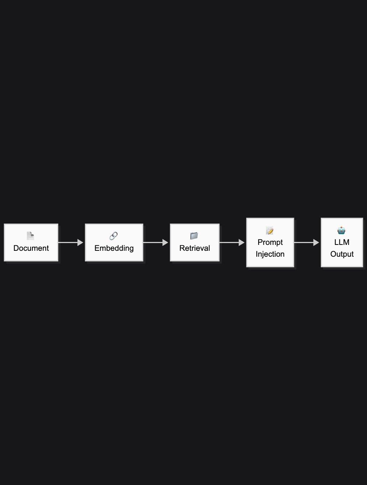

---
# Day 3 — Retrieval-Augmented Generation (RAG)
---

## Contents

<!-- START doctoc -->
<!-- END doctoc -->

-------
## Learning Objectives

- Explain why LLM-only systems fail on factual and document-based tasks

- Describe how retrieval changes what an LLM can and cannot do

- Design a basic Retrieval-Augmented Generation (RAG) pipeline using document chunking, embeddings, and semantic search

- Reason about chunking and retrieval quality and how they affect downstream answers      
- Generate grounded responses with traceable sources using different generation backends  

- Recognize when basic RAG is insufficient and what types of system upgrades are typically required

- Apply RAG thinking to real research workflows (e.g. literature review, interview analysis, policy briefs)

## Overview

### What is Retrieval-Augmented Generation?

RAG combines a language model with a search system. Instead of generating text based solely on internal training, the model first **retrieves relevant information from external sources** — then uses that to generate responses.

This is how modern research assistants, document analysis tools, and private GPTs are built.

---

## Why Use RAG?

Traditional LLMs hallucinate facts. RAG helps you:

- Ground outputs in your own research corpus
- Avoid hallucinations in sensitive domains
- Add citations and traceable sources
- Work with custom/private documents

Example use cases:
- Social science literature reviews
- Interview transcript analysis
- Real-time policy briefs
- News monitoring for public opinion

> RAG is not a **single** technique — it is a **design pattern** that evolves as requirements increase.

### RAG Capability Levels - How RAG Systems Grow in Practice

RAG systems usually evolve through a small number of capability stages,
each solving a new class of problems.

| Level | Name | What It Adds | Typical Use |
|------|------|--------------|-------------|
| 0 | LLM-only | No retrieval | Brainstorming |
| 1 | Vector Search | Semantic lookup | Document Q&A |
| 2 | Basic RAG | Retrieved context → generation | Research assistants |
| 3 | Structured RAG | Citations, metadata, filters | Audits, policy |
| 4 | Advanced RAG | Re-ranking, agents, graphs | Production systems |

---

## RAG Architecture 

1. Embed documents into a vector store (Chroma)
2. Retrieve top-k chunks based on query similarity
3. Generate text using LLM, grounded in retrieved facts

---

## Hands-On Components

----

## Core Concepts

### RAG as a system (not a prompt)

Retrieval-Augmented Generation (RAG) is a **pipeline** that connects two capabilities:

* **Retrieval**: find the right evidence from a private corpus
* **Generation**: produce an answer **grounded in that evidence**

Most failures in RAG are **retrieval failures**, not “model intelligence” failures.

---

### Ingestion (offline): turning messy documents into searchable knowledge

Ingestion is an offline **ETL** process: **Extract → Transform → Load**.

Key steps:

* **Parsing (layout-aware)**: converting PDFs/Word/HTML into structured text while preserving meaning (headings, tables, reading order)
* **Cleaning (high-signal text)**: removing duplication, boilerplate, broken formatting, and redacting sensitive content (PII)
* **Metadata capture**: attaching source IDs, dates, section names, page numbers for filtering and citations later

Goal: produce **clean, structured chunks** that can be embedded reliably.

---

### Chunking: Controlling Retrieval Precision and Context

Chunking is a core design decision in retrieval-augmented generation systems. It directly determines the trade-off between retrieval precision and the amount of contextual information available to the language model during generation.

Smaller chunks typically improve retrieval precision by narrowing semantic matches. Larger chunks provide more contextual continuity, which can improve answer quality but increases the risk of retrieving irrelevant information and exceeding context limits.

#### Common Chunking Strategies (Increasing in Sophistication)

* **Fixed-size chunking**
  Splits text into uniform token or character lengths. Simple and fast, but insensitive to document structure and prone to semantic fragmentation.

* **Recursive chunking**
  Splits content hierarchically based on document structure (e.g., sections, paragraphs). Generally the most reliable default for structured documents.

* **Semantic chunking**
  Groups text by topic or semantic coherence rather than size. Improves retrieval relevance at the cost of higher preprocessing complexity and compute.

* **Contextual (chunk + summary) approaches**
  Augments each chunk with a short contextual summary to reduce ambiguity and mitigate the problem of context-poor or “orphaned” chunks.

* **Late, page-level, or multimodal chunking**
  Defers chunking until query time or preserves layout, tables, and visual structure. Useful for documents where spatial or multimodal context affects interpretation.

#### Practical Guidance

Chunking should be treated as a **retrieval failure control mechanism**, not a formatting step. Poor chunking decisions propagate directly to retrieval errors and cannot be reliably corrected during generation.

---

### Embeddings: mapping text (and more) into vector space

An **embedding model** converts each chunk into a high-dimensional vector so “similar meaning” becomes “close distance.”

Key ideas:

* **Dimensions trade-off**: higher dims capture nuance but cost more in storage/latency/API
* **Instruction-aware embeddings**: the same text embeds differently depending on retrieval purpose
* **Matryoshka / shortened embeddings**: compress vectors (e.g., 1536 → 512) to reduce cost with minimal quality loss
* **Multimodal embeddings**: images/tables/charts can live in the same searchable space as text

Embeddings determine **what your system can “notice”** during retrieval.

---

### Vector databases: similarity search plus filters at scale

A vector database stores embeddings and supports fast **Approximate Nearest Neighbor (ANN)** search.

Core capabilities relevant to RAG:

* **Top-K similarity search**
* **Metadata filtering** (year, author, document type, user, etc.)
* **Hybrid search** (vector + keyword/BM25 for names/IDs/exact terms)
* **Indexes (HNSW / IVF)**: speed–accuracy–memory trade-offs

In practice: “good enough retrieval quickly” beats “perfect retrieval slowly.”

---

### Graph databases: adding structure for relationships and multi-hop questions

Vector search is good at **semantic similarity** (“find passages like this”).
Graph search is good at **relationships** (“how is X connected to Y?”).

A **graph database / knowledge graph** represents information as:

* **Nodes**: entities or concepts (people, organisations, policies, variables)
* **Edges**: relationships (authored, causes, contradicts, is-part-of, cites)
* **Properties**: metadata on nodes/edges (dates, confidence, sources)

Why graphs matter in RAG:

* **Multi-hop retrieval**: answer questions that require following links (A → B → C)
* **Disambiguation**: distinguish entities with similar names or meanings
* **Traceability**: show *how* an answer was derived through linked evidence
* **Constraints**: enforce structure (“only evidence connected to this project / time window”)

Typical “Graph RAG” pattern:

1. Extract entities/relations from documents (often via LLM + schema)
2. Store in a graph (plus pointers back to source text spans)
3. Use graph traversal to gather a **structured evidence set**
4. Optionally combine with vector retrieval (hybrid: graph + vectors)
5. Generate an answer with citations tied to the originating nodes/text

When to consider a graph layer (vs plain vector DB):

* Questions involve **who/what is related**, **causal chains**, **citations**, or **contradictions**
* You need consistent entity-level views across many documents (e.g., “all statements about X across years”)
* Your users ask “connective” questions, not just “lookup” questions

---

### Retrieval (online): finding the right evidence for a question

Retrieval is the bridge between the user query and your private corpus:

1. Embed the user query using the same embedding model
2. Run similarity / hybrid search (and/or graph traversal)
3. Return Top-K candidates or structured evidence
4. Optional upgrades:

   * **reranking** (cross-encoder reorders candidates)
   * **query expansion / rewriting**
   * **parent–child retrieval** (search small, return larger context)
   * **HyDE** (search using a hypothetical answer embedding)
   * **context filtering** (version/date constraints)

Retrieval quality determines whether generation is grounded or guessy.

---

### Augmentation & generation: forcing grounded answers

**Augmentation** is how retrieved evidence is injected into the prompt with constraints.

A grounded RAG prompt typically specifies:

* “Use **only** the provided context”
* “If the answer isn’t in the context, say you don’t know”
* “Include citations tied to chunk IDs / page references”

Modern systems add corrective behaviors:

* **Self-RAG / CRAG**: validate retrieved context quality before answering
* **FLARE**: retrieve again mid-generation when the model becomes uncertain

---

### Evaluation: measure retriever and generator separately

RAG quality is assessed by measuring links between:

* **Query ↔ Context** (Contextual Relevancy: did we retrieve the right evidence?)
* **Context ↔ Response** (Faithfulness: is the answer supported by evidence?)
* **Query ↔ Response** (Answer Relevancy: does it address intent?)

Retriever-focused metrics often include **Recall@K, MRR, NDCG**.
Production monitoring focuses on **latency, cost per query, and refusal (“I don’t know”) rates**.
--------
Below is **exact, MD-ready content** you can drop in.
It is **non-overlapping** with *Core Concepts*, design-focused, and pitched at *drawing-board* level (no premature implementation depth).

---

## Design Considerations

This section focuses on **decision points** you must make when designing a RAG system. There are no universally correct choices—only trade-offs.

### Retrieval is the primary failure surface

Most RAG errors originate from **poor retrieval**, not weak language models.

Design implication:

* Invest effort in **chunking, embeddings, and retrieval strategy** before tuning generation.
* Treat generation as a *consumer* of retrieval quality, not a fix for it.

---

### Chunk size vs. context completeness

Chunking creates an inherent tension:

* **Smaller chunks** → higher retrieval precision
* **Larger chunks** → better generation coherence

Design patterns:

* Use **small chunks for search**, then expand context (parent–child retrieval)
* Add **document-level summaries or metadata** to preserve meaning
* Prefer recursive or semantic chunking over fixed-size splits

---

### Embedding choice defines what “similar” means

Embedding models encode *assumptions* about meaning.

Consider:

* Domain specificity often matters more than model size
* Lower-dimensional embeddings reduce cost and latency but may lose nuance
* Instruction-aware embeddings change retrieval behaviour depending on task

Design implication:

> Choose embeddings based on *query intent*, not benchmark scores.

---

### Vector search vs. graph structure

Vector databases and graph databases solve **different classes of problems**.

* **Vector search** excels at fuzzy semantic matching
* **Graph search** excels at relationships, constraints, and multi-hop reasoning

Design rule of thumb:

* Use vectors to *find candidates*
* Use graphs to *reason over structure*
* Combine them when questions require both similarity and relationships

---

### Precision layers are optional—until they aren’t

Basic RAG pipelines often fail quietly.

Warning signs that upgrades are needed:

* Retrieved chunks look relevant but don’t answer the question
* Correct information exists but isn’t surfaced
* Answers change depending on phrasing

Common precision upgrades:

* Hybrid search (vector + keyword)
* Reranking
* Metadata filtering
* Query rewriting / expansion

---

### Cost, latency, and trust form a triangle

You can usually optimise **two**, not all three.

* Lower latency often reduces retrieval depth
* Higher accuracy increases compute and cost
* Trust (citations, provenance) adds system complexity

Design implication:

> Decide which dimension matters most *before* scaling.

---

## Limitations and Extensions

This section clarifies **what RAG does not solve** and where systems typically evolve next.

---

### Limitations of basic RAG

**RAG does not guarantee correctness**

* It grounds answers in retrieved text, not in “truth”
* If the corpus is wrong or incomplete, answers will be too

**RAG struggles with synthesis**

* Comparing arguments across many sources
* Reconciling contradictions
* Drawing causal conclusions

**RAG is sensitive to data drift**

* As documents change, retrieval quality degrades
* Indexes require monitoring and re-ingestion

---

### When RAG alone is insufficient

You will likely need extensions when:

* Questions require **multi-step reasoning**
* Answers depend on **relationships across documents**
* Users expect **consistent entity-level views**
* Errors carry **legal, policy, or compliance risk**

---

### Common extension paths

**Structured retrieval**

* Metadata-heavy filtering
* Parent–child retrieval
* Section-aware indexing

**Graph-augmented RAG**

* Knowledge graphs for entities and relations
* Graph traversal before generation
* Explicit reasoning paths with citations

**Agentic RAG**

* Iterative retrieval during generation
* Self-checking and corrective loops
* Tool-augmented reasoning (search, calculate, verify)

**Evaluation & monitoring**

* Retriever–generator separation
* Continuous quality tracking
* Failure analysis via tracing tools

---

## Key takeaway

RAG is not a single technique—it is a **foundation**.

Most real systems evolve by:

1. Improving retrieval precision
2. Adding structure (metadata, graphs)
3. Introducing feedback and evaluation loops

Understanding these boundaries is more valuable than building a perfect first pipeline.

---

## Related Files

### Core RAG & Retrieval

* **RAG (Original paper)** — Lewis et al. (2020)
  [https://arxiv.org/abs/2005.11401](https://arxiv.org/abs/2005.11401)

* **Dense Passage Retrieval (DPR)** — foundational vector retrieval method
  [https://arxiv.org/abs/2004.04906](https://arxiv.org/abs/2004.04906)

---

### Chunking & Embeddings

* **Sentence-Transformers documentation**
  [https://www.sbert.net/](https://www.sbert.net/)

* **BGE Embeddings (BAAI)** — widely used open-source embedding family
  [https://github.com/FlagOpen/FlagEmbedding](https://github.com/FlagOpen/FlagEmbedding)

* **Matryoshka Representation Learning (MRL)**
  [https://arxiv.org/abs/2205.13147](https://arxiv.org/abs/2205.13147)

---

### Vector Databases

* **ChromaDB (local / lightweight)**
  [https://docs.trychroma.com/](https://docs.trychroma.com/)

* **FAISS (Meta)** — ANN indexing fundamentals
  [https://github.com/facebookresearch/faiss](https://github.com/facebookresearch/faiss)

* **Milvus (scalable vector DB)**
  [https://milvus.io/docs](https://milvus.io/docs)

---

### Graph RAG & Knowledge Graphs

* **GraphRAG (Microsoft Research)**
  [https://github.com/microsoft/graphrag](https://github.com/microsoft/graphrag)

* **Neo4j + LLMs (Graph-based RAG patterns)**
  [https://neo4j.com/developer/graph-data-science/llms/](https://neo4j.com/developer/graph-data-science/llms/)

---

### Advanced Retrieval Techniques

* **Hybrid Search & BM25 (Elastic overview)**
  [https://www.elastic.co/what-is/hybrid-search](https://www.elastic.co/what-is/hybrid-search)

* **HyDE: Hypothetical Document Embeddings**
  [https://arxiv.org/abs/2212.10496](https://arxiv.org/abs/2212.10496)

* **Reranking with Cross-Encoders**
  [https://www.sbert.net/examples/applications/retrieve_rerank/README.html](https://www.sbert.net/examples/applications/retrieve_rerank/README.html)

---

### Evaluation & Monitoring

* **RAGAS: RAG evaluation framework**
  [https://github.com/explodinggradients/ragas](https://github.com/explodinggradients/ragas)

* **TruLens (Tracing & evaluation)**
  [https://www.trulens.org/](https://www.trulens.org/)

---
